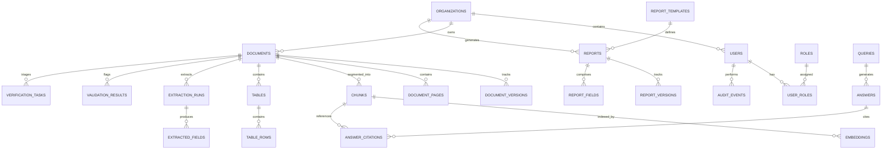

# DATABASE_SCHEMA.md
# CIL / CMPDI AI Reporting & Intelligence Platform
# Database Relational Schema Specification

## 1. Design Principles
- Relational integrity with foreign keys, composite indexes, and timestamp triggers.
- Support for PostgreSQL 16+ with `pgvector` in production, with fallback compatibility for SQLite in local standalone development.
- Separation of raw document content from extracted entities and derived AI embeddings.
- Full auditability: every modifying action records actor ID, organization ID, and timestamp.

---

## 2. Entity-Relationship Overview

---

## 3. Detailed Table Specifications

### 3.1 Organization & Identity

#### `organizations`
| Column | Type | Constraints | Description |
|---|---|---|---|
| `id` | VARCHAR(36) | PRIMARY KEY | UUID identifier |
| `code` | VARCHAR(50) | UNIQUE, NOT NULL | E.g. 'CIL_HQ', 'CMPDI_HQ', 'RI_1', 'ECL', 'SECL' |
| `name` | VARCHAR(255) | NOT NULL | Full name of entity |
| `org_type` | VARCHAR(50) | NOT NULL | 'HQ', 'REGIONAL_INSTITUTE', 'SUBSIDIARY', 'AREA', 'MINE' |
| `parent_id` | VARCHAR(36) | REFERENCES organizations(id) | Self-referencing parent hierarchy |
| `is_active` | BOOLEAN | DEFAULT TRUE | Active status flag |
| `metadata` | JSONB | DEFAULT '{}' | Metadata (state, headquarter city, etc.) |
| `created_at` | TIMESTAMP | DEFAULT NOW() | Registration timestamp |

#### `organization_relationships`
| Column | Type | Constraints | Description |
|---|---|---|---|
| `id` | VARCHAR(36) | PRIMARY KEY | UUID identifier |
| `source_org_id` | VARCHAR(36) | REFERENCES organizations(id) | Source organization |
| `target_org_id` | VARCHAR(36) | REFERENCES organizations(id) | Target organization |
| `relationship_type` | VARCHAR(50) | NOT NULL | E.g. 'CORRESPONDING_SUBSIDIARY', 'MONITORS' |

#### `users`
| Column | Type | Constraints | Description |
|---|---|---|---|
| `id` | VARCHAR(36) | PRIMARY KEY | UUID identifier |
| `username` | VARCHAR(100) | UNIQUE, NOT NULL | Login username |
| `email` | VARCHAR(255) | UNIQUE, NOT NULL | Official email |
| `full_name` | VARCHAR(255) | NOT NULL | Full display name |
| `hashed_password` | VARCHAR(255) | NOT NULL | Argon2 / bcrypt hash |
| `organization_id` | VARCHAR(36) | REFERENCES organizations(id) | Assigned organization scope |
| `is_active` | BOOLEAN | DEFAULT TRUE | Account active flag |
| `created_at` | TIMESTAMP | DEFAULT NOW() | Creation timestamp |

#### `roles`
| Column | Type | Constraints | Description |
|---|---|---|---|
| `id` | VARCHAR(36) | PRIMARY KEY | UUID identifier |
| `code` | VARCHAR(50) | UNIQUE, NOT NULL | E.g. 'MINISTRY_OFFICER', 'CMPDI_HQ_OFFICER', 'RI_ANALYST', 'SUBSIDIARY_ANALYST', 'VERIFICATION_OFFICER', 'SYSTEM_ADMIN' |
| `name` | VARCHAR(255) | NOT NULL | Display name of role |
| `description` | TEXT | | Description of scope and duties |
| `permissions` | JSONB | NOT NULL | Array of permission strings |

#### `user_roles`
| Column | Type | Constraints | Description |
|---|---|---|---|
| `user_id` | VARCHAR(36) | REFERENCES users(id) | User FK |
| `role_id` | VARCHAR(36) | REFERENCES roles(id) | Role FK |
| PRIMARY KEY | (user_id, role_id) | | Composite primary key |

---

### 3.2 Document Intelligence & Structure

#### `documents`
| Column | Type | Constraints | Description |
|---|---|---|---|
| `id` | VARCHAR(36) | PRIMARY KEY | UUID identifier |
| `organization_id` | VARCHAR(36) | REFERENCES organizations(id) | Owning organization scope |
| `title` | VARCHAR(255) | NOT NULL | Document title |
| `document_type` | VARCHAR(100) | NOT NULL | 'GEOLOGICAL_REPORT', 'PRODUCTION_SUMMARY', 'BOREHOLE_LOG', 'STRIPPING_RETURN', 'STATUTORY_FILING' |
| `source_tier` | VARCHAR(20) | DEFAULT 'TIER_B' | 'TIER_A' (Authoritative), 'TIER_B' (Internal Operational), 'TIER_C' (Unverified) |
| `original_filename`| VARCHAR(255) | NOT NULL | Original upload name |
| `file_path` | VARCHAR(500) | NOT NULL | Internal filesystem path |
| `mime_type` | VARCHAR(100) | NOT NULL | Detected MIME type |
| `file_size_bytes` | BIGINT | NOT NULL | Size in bytes |
| `sha256_hash` | VARCHAR(64) | NOT NULL | Cryptographic checksum |
| `status` | VARCHAR(50) | DEFAULT 'QUEUED' | 'QUEUED', 'PARSING', 'EXTRACTING', 'INDEXED', 'FAILED' |
| `is_demo_data` | BOOLEAN | DEFAULT FALSE | Flag indicating synthetic/demo data |
| `created_by` | VARCHAR(36) | REFERENCES users(id) | Uploader user FK |
| `created_at` | TIMESTAMP | DEFAULT NOW() | Upload timestamp |
| `updated_at` | TIMESTAMP | DEFAULT NOW() | Last modification timestamp |

#### `document_versions`
| Column | Type | Constraints | Description |
|---|---|---|---|
| `id` | VARCHAR(36) | PRIMARY KEY | UUID identifier |
| `document_id` | VARCHAR(36) | REFERENCES documents(id) | Parent document |
| `version_number` | INTEGER | NOT NULL | Monotonically increasing version |
| `supersedes_id` | VARCHAR(36) | REFERENCES documents(id) | Document superseded by this version |
| `file_path` | VARCHAR(500) | NOT NULL | File storage path for version |
| `sha256_hash` | VARCHAR(64) | NOT NULL | Checksum of version |
| `change_summary` | TEXT | | Summary of modifications |
| `created_at` | TIMESTAMP | DEFAULT NOW() | Creation timestamp |

#### `document_pages`
| Column | Type | Constraints | Description |
|---|---|---|---|
| `id` | VARCHAR(36) | PRIMARY KEY | UUID identifier |
| `document_id` | VARCHAR(36) | REFERENCES documents(id) | Parent document |
| `page_number` | INTEGER | NOT NULL | 1-indexed page number |
| `raw_text` | TEXT | | Extracted text content |
| `ocr_applied` | BOOLEAN | DEFAULT FALSE | Whether local OCR was required |
| `ocr_confidence` | FLOAT | | Average OCR confidence (0.0 - 1.0) |
| `page_image_path` | VARCHAR(500) | | Rendered page image for preview |

#### `chunks`
| Column | Type | Constraints | Description |
|---|---|---|---|
| `id` | VARCHAR(36) | PRIMARY KEY | UUID identifier |
| `document_id` | VARCHAR(36) | REFERENCES documents(id) | Parent document |
| `page_number` | INTEGER | NOT NULL | Source page reference |
| `chunk_index` | INTEGER | NOT NULL | Sequence order within document |
| `chunk_type` | VARCHAR(50) | DEFAULT 'TEXT' | 'TEXT', 'TABLE', 'BOREHOLE_LOG', 'SECTION_HEADER' |
| `content` | TEXT | NOT NULL | Clean chunk content |
| `metadata` | JSONB | DEFAULT '{}' | Header context, section path |

#### `embeddings`
| Column | Type | Constraints | Description |
|---|---|---|---|
| `id` | VARCHAR(36) | PRIMARY KEY | UUID identifier |
| `chunk_id` | VARCHAR(36) | REFERENCES chunks(id) ON DELETE CASCADE | Parent chunk FK |
| `model_name` | VARCHAR(100) | NOT NULL | E.g. 'all-MiniLM-L6-v2' |
| `embedding_version`| VARCHAR(50) | DEFAULT '1.0.0' | Embedding generator logic version |
| `dimensions` | INTEGER | NOT NULL | E.g. 384 or 768 |
| `vector_data` | VECTOR(384) | | pgvector column with HNSW cosine index `idx_embeddings_vector` |
| `created_at` | TIMESTAMP | DEFAULT NOW() | Generation timestamp |
| **Unique Constraint** | `uq_chunk_embedding_model` | UNIQUE(chunk_id, model_name) | Idempotent indexing constraint |

#### `tables` & `table_rows`
- `tables`: `id`, `document_id`, `page_number`, `table_index`, `caption`, `num_rows`, `num_cols`, `headers` (JSONB)
- `table_rows`: `id`, `table_id`, `row_index`, `cells` (JSONB)

---

### 3.3 Structured Extraction, Validation & Reconciliation

#### `extraction_runs`
| Column | Type | Constraints | Description |
|---|---|---|---|
| `id` | VARCHAR(36) | PRIMARY KEY | UUID identifier |
| `document_id` | VARCHAR(36) | REFERENCES documents(id) | Associated document |
| `started_at` | TIMESTAMP | DEFAULT NOW() | Execution start |
| `completed_at` | TIMESTAMP | | Execution end |
| `status` | VARCHAR(50) | DEFAULT 'RUNNING' | 'RUNNING', 'COMPLETED', 'FAILED' |
| `fields_extracted_count` | INTEGER | DEFAULT 0 | Total fields parsed |
| `validation_issues_count` | INTEGER | DEFAULT 0 | Issues flagged |
| `conflicts_count` | INTEGER | DEFAULT 0 | Reconciliation conflicts detected |
| `extractor_versions` | JSONB | DEFAULT '{}' | Metadata & versions of extractors |

#### `extracted_fields`
| Column | Type | Constraints | Description |
|---|---|---|---|
| `id` | VARCHAR(36) | PRIMARY KEY | UUID identifier |
| `extraction_run_id`| VARCHAR(36) | REFERENCES extraction_runs(id) | Execution run FK |
| `document_id` | VARCHAR(36) | REFERENCES documents(id) | Source document FK |
| `field_name` | VARCHAR(100) | NOT NULL | Canonical identifier (e.g. 'production_mt', 'stripping_ratio') |
| `field_category` | VARCHAR(50) | NOT NULL | 'IDENTIFICATION', 'GEOLOGY', 'MINING' |
| `data_type` | VARCHAR(50) | NOT NULL | 'STRING', 'NUMERIC', 'PERCENTAGE', 'DATE' |
| `raw_value` | TEXT | NOT NULL | Raw text as extracted from source |
| `normalized_value`| TEXT | | Cleaned/canonical representation |
| `numeric_value` | FLOAT | | Parsed numeric value for computation |
| `unit` | VARCHAR(50) | | Measurement unit ('MT', 'cum/tonne', '%', 'm') |
| `page_number` | INTEGER | | Exact physical page where found (from TableRow.source_page or Page) |
| `table_id` | VARCHAR(36) | REFERENCES tables(id) | Table provenance (if from table) |
| `row_id` | VARCHAR(36) | REFERENCES table_rows(id) | Exact row provenance |
| `chunk_id` | VARCHAR(36) | REFERENCES chunks(id) | Chunk provenance |
| `source_text` | TEXT | | Surrounding context sentence/row snippet |
| `extraction_method`| VARCHAR(50) | NOT NULL | 'RULE_REGEX', 'RULE_TABLE', 'LOCAL_LLM' |
| `confidence_score` | FLOAT | NOT NULL | Confidence score (0.0 - 1.0) |
| `confidence_level` | VARCHAR(20) | NOT NULL | 'HIGH', 'MEDIUM', 'LOW' |
| `validation_status`| VARCHAR(50) | DEFAULT 'PENDING' | 'PASS', 'WARNING', 'ERROR' |
| `reconciliation_status`| VARCHAR(50) | DEFAULT 'UNRECONCILED' | 'UNRECONCILED', 'CONSISTENT', 'CONFLICT', 'RESOLVED' |
| `verification_status`| VARCHAR(50) | DEFAULT 'UNVERIFIED' | 'UNVERIFIED', 'VERIFIED', 'CORRECTED', 'REJECTED' |
| `is_corrected` | BOOLEAN | DEFAULT FALSE | Human correction indicator |
| `corrected_value` | TEXT | | Human-corrected value (raw value preserved) |
| `corrected_by` | VARCHAR(36) | REFERENCES users(id) | Verifier who corrected |
| `corrected_at` | TIMESTAMP | | Correction timestamp |
| `created_at` | TIMESTAMP | DEFAULT NOW() | Extraction timestamp |

#### `validation_results`
| Column | Type | Constraints | Description |
|---|---|---|---|
| `id` | VARCHAR(36) | PRIMARY KEY | UUID identifier |
| `field_id` | VARCHAR(36) | REFERENCES extracted_fields(id) | Evaluated field FK |
| `document_id` | VARCHAR(36) | REFERENCES documents(id) | Evaluated document FK |
| `rule_name` | VARCHAR(100) | NOT NULL | E.g. 'NON_NEGATIVE', 'REASONABLE_STRIPPING_RATIO', 'ASH_CONTENT_SANITY' |
| `rule_category` | VARCHAR(50) | NOT NULL | 'TYPE_CHECK', 'RANGE_CHECK', 'UNIT_SANITY', 'CROSS_DOC' |
| `status` | VARCHAR(20) | NOT NULL | 'PASS', 'WARNING', 'ERROR' |
| `severity` | VARCHAR(20) | NOT NULL | 'INFO', 'LOW', 'MEDIUM', 'HIGH', 'CRITICAL' |
| `message` | TEXT | NOT NULL | Descriptive validation feedback |
| `observed_value` | VARCHAR(255) | | Value seen during evaluation |
| `expected_constraint`| VARCHAR(255) | | Expected domain boundary |
| `created_at` | TIMESTAMP | DEFAULT NOW() | Validation timestamp |

#### `reconciliation_groups` & `reconciliation_candidates`
- `reconciliation_groups`: `id`, `organization_id`, `entity_name`, `metric_name`, `fiscal_period`, `status` ('CONSISTENT', 'CONFLICT', 'RESOLVED'), `discrepancy_details` (JSONB), `resolved_value`, `resolved_by`, `resolved_at`, `created_at`
- `reconciliation_candidates`: `id`, `group_id`, `field_id`, `document_id`, `reported_value`, `numeric_value`, `unit`, `is_selected`

---

### 3.4 Grounded Q&A, Reports & Verification

#### `verification_tasks`
| Column | Type | Constraints | Description |
|---|---|---|---|
| `id` | VARCHAR(36) | PRIMARY KEY | UUID identifier |
| `task_type` | VARCHAR(50) | NOT NULL | 'LOW_CONFIDENCE_OCR', 'VALIDATION_ERROR', 'CROSS_DOC_CONFLICT', 'TABLE_CONTINUATION_REVIEW', 'SUSPICIOUS_METRIC' |
| `document_id` | VARCHAR(36) | REFERENCES documents(id) | Associated document |
| `organization_id` | VARCHAR(36) | REFERENCES organizations(id) | Scoped organization |
| `field_id` | VARCHAR(36) | REFERENCES extracted_fields(id) | Flagged field (if applicable) |
| `reconciliation_group_id`| VARCHAR(36) | REFERENCES reconciliation_groups(id) | Flagged discrepancy group |
| `status` | VARCHAR(50) | DEFAULT 'PENDING' | 'PENDING', 'APPROVED', 'CORRECTED', 'REJECTED', 'DEFERRED' |
| `action_taken` | VARCHAR(50) | | Human action performed |
| `corrected_value` | TEXT | | Corrected value (preserves raw) |
| `review_notes` | TEXT | | Reviewer rationale |
| `reviewed_by` | VARCHAR(36) | REFERENCES users(id) | Reviewer FK |
| `reviewed_at` | TIMESTAMP | | Action timestamp |
| `evidence_context` | JSONB | DEFAULT '{}' | Contextual evidence snippets and metrics |
| `created_at` | TIMESTAMP | DEFAULT NOW() | Queue entry timestamp |

#### `audit_events`
- `id`, `actor_id`, `actor_name`, `role_code`, `organization_id`, `action`, `object_type`, `object_id`, `sha256_hash`, `ip_address`, `details` (JSONB), `created_at`

#### `queries`, `answers`, `answer_citations` (Phase 5+)
- `queries`: `id`, `user_id`, `organization_id`, `query_text`, `normalized_query`, `filters_applied` (JSONB), `executed_at`
- `answers`: `id`, `query_id`, `answer_text`, `confidence_score`, `verification_status` ('SUPPORTED', 'PARTIAL', 'REFUSED'), `latency_ms`
- `answer_citations`: `id`, `answer_id`, `chunk_id`, `document_id`, `page_number`, `excerpt`, `score`

#### `reports`, `report_versions`, `report_templates`, `report_fields` (Phase 7+)
- `report_templates`: `id`, `code`, `name`, `description`, `schema_definition` (JSONB), `template_docx_path`
- `reports`: `id`, `report_template_id`, `organization_id`, `title`, `period`, `status` ('DRAFT', 'PENDING_APPROVAL', 'APPROVED', 'REJECTED'), `created_by`, `reviewer_id`, `file_path`, `docx_hash`, `json_snapshot` (JSONB), `created_at`, `approved_at`
- `report_versions`: `id`, `report_id`, `version_number`, `supersedes_id`, `file_path`, `docx_hash`, `json_snapshot` (JSONB), `change_summary`, `created_at`
- `report_fields`: `id`, `report_id`, `field_name`, `field_value`, `source_document_id`, `source_page`, `validation_status`

---

### 3.5 Topic Intelligence & Temporal Analytics (Phase 8+)

#### `topic_analyses`
| Column | Type | Constraints | Description |
|---|---|---|---|
| `id` | VARCHAR(36) | PRIMARY KEY | UUID identifier |
| `organization_id` | VARCHAR(36) | REFERENCES organizations(id) | Organization scope |
| `corpus_filters` | JSONB | NOT NULL | Filters applied (FY, mine, block, doc type) |
| `corpus_hash` | VARCHAR(64) | INDEX, NOT NULL | Deterministic SHA-256 of corpus document UUIDs |
| `embedding_model` | VARCHAR(100)| NOT NULL | E.g. 'BAAI/bge-small-en-v1.5' |
| `analysis_method` | VARCHAR(50) | NOT NULL | 'FOUNDATION', 'EMBEDDING_CLUSTER_CTFIDF' |
| `parameters` | JSONB | NOT NULL | min_topic_size, n_clusters, sample gates |
| `status` | VARCHAR(50) | NOT NULL | 'QUEUED', 'RUNNING', 'COMPLETED', 'FAILED' |
| `progress_pct` | INTEGER | NOT NULL | 0 to 100 |
| `runtime_seconds`| FLOAT | | Execution latency |
| `document_count` | INTEGER | NOT NULL | Number of documents evaluated |
| `chunk_count` | INTEGER | NOT NULL | Number of chunks clustered |
| `outlier_count` | INTEGER | NOT NULL | Chunks marked as noise (-1) |
| `quality_metrics`| JSONB | | Coherence, silhouette, quality scores |
| `error_message` | TEXT | | Failure diagnostics if failed |
| `created_by` | VARCHAR(36) | REFERENCES users(id) | Actor user UUID |
| `created_at` | TIMESTAMP | NOT NULL | Submission timestamp |
| `completed_at` | TIMESTAMP | | Completion timestamp |

#### `topics`
| Column | Type | Constraints | Description |
|---|---|---|---|
| `id` | VARCHAR(36) | PRIMARY KEY | UUID identifier |
| `analysis_id` | VARCHAR(36) | REFERENCES topic_analyses(id) | Associated analysis run |
| `topic_index` | INTEGER | NOT NULL | Topic numerical index |
| `label` | VARCHAR(255) | | Mathematically derived semantic label |
| `document_count` | INTEGER | NOT NULL | Documents containing this topic |
| `chunk_count` | INTEGER | NOT NULL | Chunks assigned to this topic |
| `prevalence_pct` | FLOAT | NOT NULL | % of total corpus chunks |
| `coherence_score`| FLOAT | | Semantic topic coherence diagnostic |
| `metadata_json` | JSONB | | Additional diagnostic attributes |

#### `topic_terms`
- `id`, `topic_id` (FK), `term`, `weight` (c-TF-IDF), `rank`, `frequency`, `document_count`. Composite index: `(topic_id, rank)`.

#### `topic_documents`
- `id`, `topic_id` (FK), `document_id` (FK), `similarity_score`, `contribution_pct`. Composite index: `(topic_id, document_id)`.

#### `topic_evidence`
- `id`, `topic_id` (FK), `chunk_id` (FK), `representative_score`. Composite index: `(topic_id, chunk_id)`.

#### `topic_trends`
| Column | Type | Constraints | Description |
|---|---|---|---|
| `id` | VARCHAR(36) | PRIMARY KEY | UUID identifier |
| `analysis_id` | VARCHAR(36) | REFERENCES topic_analyses(id) | Associated analysis run |
| `topic_id` | VARCHAR(36) | REFERENCES topics(id) | Associated topic |
| `period_type` | VARCHAR(50) | NOT NULL | 'FISCAL_YEAR' |
| `period_value` | VARCHAR(50) | INDEX, NOT NULL | E.g. 'FY2023-24', 'FY2024-25' |
| `document_count` | INTEGER | NOT NULL | Topic documents in period (numerator) |
| `chunk_count` | INTEGER | NOT NULL | Topic chunks in period |
| `corpus_document_count`| INTEGER | NOT NULL | Total period documents (denominator) |
| `corpus_chunk_count` | INTEGER | NOT NULL | Total period chunks (denominator) |
| `document_share_pct` | FLOAT | NOT NULL | Document prevalence share (%) |
| `chunk_share_pct` | FLOAT | NOT NULL | Chunk prevalence share (%) |
| `absolute_change` | INTEGER | | Raw doc difference vs prior period ($\Delta_{abs}$) |
| `percentage_point_change`| FLOAT | | $\Delta_{pp}$ vs prior period |
| `growth_rate_pct` | FLOAT | | Relative growth $g_{rel}$ (%) |
| `trend_status` | VARCHAR(50) | NOT NULL | 'INSUFFICIENT_HISTORY', 'GROWING', 'STABLE', 'DECLINING', 'EMERGING', 'DISAPPEARING', 'RECURRING' |
| `metadata_json` | JSONB | | Diagnostics & numerator/denominator audit |

#### `topic_comparisons`
- `id`, `analysis_id` (FK), `topic_id` (FK), `dimension_type` ('SUBSIDIARY', 'MINE', 'BLOCK', 'DOCUMENT_TYPE'), `dimension_a`, `dimension_b`, `value_a`, `value_b`, `difference`, `difference_pct_points`, `document_count_a`, `document_count_b`, `chunk_count_a`, `chunk_count_b`, `metadata_json`.

