# TEST_PLAN.md
# CIL / CMPDI AI Reporting & Intelligence Platform
# Comprehensive Test & Quality Assurance Plan

## 1. Quality Objectives
Ensure 100% verifiable reliability, compliance with SIH Problem Statement 26023, zero external runtime AI API calls, zero silent failures, and complete provenance tracking across the document-to-report lifecycle.

---

## 2. Testing Levels & Matrix

```mermaid
flowchart TD
    subgraph Level_1 ["Unit Testing (Pytest + Vitest)"]
        U1["SHA-256 Hashing & Deduplication"]
        U2["PDF/DOCX/XLSX Parsers & Tables"]
        U3["Deterministic Validation Rules"]
        U4["Reciprocal Rank Fusion (RRF)"]
        U5["RBAC & Scope Evaluator"]
        U6["DOCX Template Populator"]
    end

    subgraph Level_2 ["Integration Testing (Pytest + FastAPI TestClient)"]
        I1["File Ingestion Pipeline & Jobs"]
        I2["Local OCR Pipeline (OpenCV + Engine)"]
        I3["Domain Extraction & Conflict Generator"]
        I4["Hybrid Search & Citation Mapper"]
        I5["Grounded Q&A & Refusal Fallback"]
        I6["Report Generation & Approval Flow"]
    end

    subgraph Level_3 ["End-to-End Browser Testing (Playwright)"]
        E1["Login with Role & Switch Org Context"]
        E2["Upload PDF Document & Verify Processing"]
        E3["Inspect Extracted Fields & Validation Issue"]
        E4["Run Grounded Search & Inspect Citations"]
        E5["Submit Grounded Question & Check Citations"]
        E6["Submit Ungrounded Question & Verify Refusal"]
        E7["Generate Report & Download DOCX"]
        E8["Review & Approve Item in Verification Queue"]
        E9["Verify Audit Log Entry for Actions"]
        E10["Check Dashboard Live Calculated Metrics"]
    end

    Level_1 --> Level_2 --> Level_3
```

---

## 3. Unit Test Specifications

### 3.1 Document Ingestion & Parsers (`backend/tests/test_parsers.py`)
- `test_sha256_hash_calculation`: Verifies consistent SHA-256 calculation across chunked binary streams.
- `test_pdf_digital_text_extraction`: Verifies PyMuPDF extracts full text when printable density $> 50$ chars/page.
- `test_table_structure_preservation`: Verifies multi-column tabular data retains column headers and rows in markdown/JSON format.
- `test_xlsx_parser_cell_coordinates`: Verifies openpyxl extracts cell values with sheet name and coordinates (`Sheet1!C12`).
- `test_docx_parser_headings`: Verifies python-docx preserves heading depth and paragraph structure.

### 3.2 Deterministic Validation Engine (`backend/tests/test_validation.py`)
- `test_numeric_range_validation`: Verifies stripping ratio rule catches out-of-bounds inputs ($< 0.1$ or $> 30.0$).
- `test_unit_consistency`: Verifies automatic conversion or warning when units are mixed ($MT$ vs $Tonnes$ vs $Lakh Tonnes$).
- `test_cross_document_conflict_detection`: Compares two documents reporting differing coal reserves for the same mine/fiscal year and creates an explicit `CONFLICT` validation issue.

### 3.3 Hybrid Search, Indexing & RRF (`backend/tests/test_retrieval.py`)
- `test_embedding_provider_dimension_and_normalization`: Verifies 384-dimensional unit L2 normalized output vectors.
- `test_chunk_indexing_and_duplicate_prevention`: Verifies idempotent embedding generation and unique constraint enforcement.
- `test_keyword_retrieval_exact_terms`: Validates PostgreSQL FTS / tsvector ranking on exact domain tokens.
- `test_dense_semantic_retrieval`: Validates pgvector cosine similarity ranking (`vector_data <=> query_vector`).
- `test_reciprocal_rank_fusion`: Validates standard reciprocal rank fusion scoring formula ($k=60$) combining keyword and dense ranks.
- `test_local_reranker_fallback`: Validates graceful degradation when sentence-transformers is unavailable without fabricating fake scores.
- `test_query_normalization_entities_and_temporality`: Validates extraction of subsidiaries, mine/block entities, metrics, and fiscal year ranges.
- `test_temporal_and_metadata_filtering`: Validates strict date-range and metadata filtering over candidate sets.
- `test_multipage_table_provenance_preservation`: Validates retrieval candidates preserve logical table ID, part number, total parts, and spanned pages.
- `test_server_side_organization_security_isolation`: Confirms subsidiary/RI users cannot retrieve documents outside their scope.
- `test_api_search_query_and_trace`: Validates `POST /api/v1/search/query` endpoint schema, candidates, and latency trace breakdown.
- `test_api_search_status_and_reindex`: Validates `GET /api/v1/search/status` and `POST /api/v1/search/reindex` execution.

### 3.4 Grounded Q&A & Refusal (`backend/tests/test_qa.py`)
- `test_qa_evidence_extraction`: Verifies answer text is composed solely of approved evidence spans with exact citation references.
- `test_qa_refusal_on_insufficient_evidence`: Verifies that querying for an unindexed concept (e.g. *"What is the uranium enrichment capacity of Dipka mine?"*) deterministically outputs the refusal response: *"Insufficient verified evidence found in the indexed sources."*

---

## 4. Integration Test Specifications (`backend/tests/test_api_flows.py`)
- `test_auth_rbac_enforcement`: Tests that an analyst from ECL cannot access SECL restricted documents (403 Forbidden), while Ministry Officer can view both.
- `test_report_generation_docx`: Triggers `/api/v1/reports/generate` and confirms that a genuine valid `.docx` file is saved to disk and its hash matches the database record.
- `test_verification_approval_workflow`: Resolves a validation issue via `/api/v1/verification/tasks/{id}/action` and verifies the status updates and an audit event is logged.

---

## 5. Playwright End-to-End Automated Browser Test Suite
Automated browser script executing the full end-to-end demo path:
1. Navigate to `/login` $\rightarrow$ Authenticate as `CMPDI_HQ_OFFICER`.
2. Navigate to `/documents/ingest` $\rightarrow$ Upload test PDF `SECL_Gevra_Monthly_Production_May2024.pdf`.
3. Wait for status badge `INDEXED`.
4. Navigate to `/documents/:id` $\rightarrow$ Inspect extracted fields (`production_mt: 4.85`, `stripping_ratio: 1.35`).
5. Open `/query` $\rightarrow$ Submit: *"What was Gevra OCP coal production in May 2024?"*.
6. Verify answer contains `4.85 MT` and citation tag citing `SECL_Gevra_Monthly_Production_May2024.pdf`, page 1.
7. Submit ungrounded question: *"What is the lithium reserve in Bilaspur?"*.
8. Verify system refuses with *"Insufficient verified evidence..."*.
9. Open `/reports/new` $\rightarrow$ Generate *Monthly Production Summary* for SECL.
10. Verify DOCX download works.
11. Open `/verification` $\rightarrow$ Approve pending item.
12. Open `/governance` $\rightarrow$ Confirm audit records match executed operations.
13. Open `/dashboard` $\rightarrow$ Verify KPI cards reflect incremented counters.
